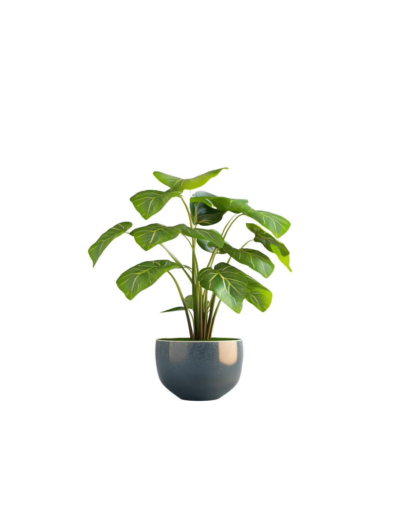
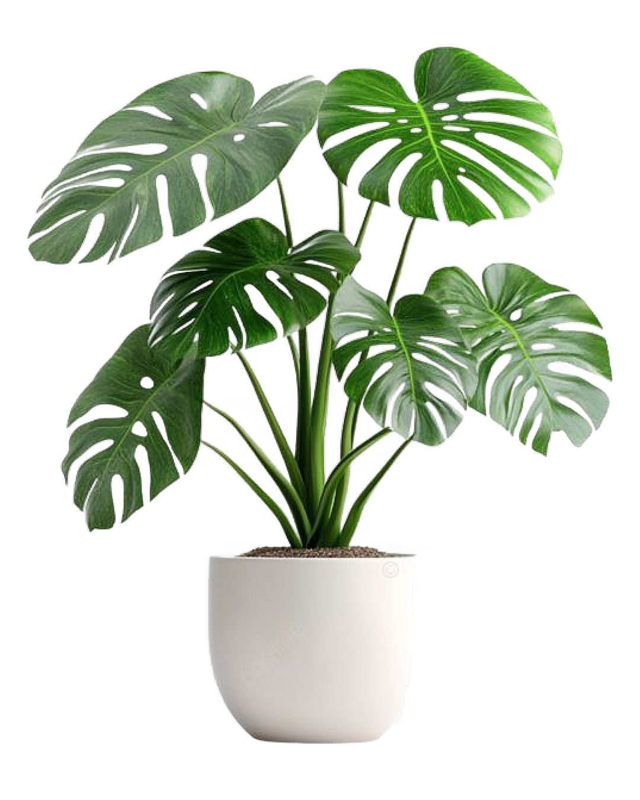

# 🌱 GreenThumb Gardens

*Where Nature Greets You with a Smile.*

[](https://react.dev)
[](https://vitejs.dev)
[](https://tailwindcss.com)
[](https://greensock.com/gsap/)
[](https://developer.mozilla.org/en-US/docs/Web/JavaScript)
[](https://opensource.org/licenses/MIT)

---

## 📖 Introduction

**GreenThumb Gardens** is a premium, highly interactive nursery and organic gardening showcase web application. Built using **React 19**, **Vite**, **Tailwind CSS v4**, and animated with **GSAP (GreenSock Animation Platform)**, the platform delivers a modern, visually stunning experience designed to inspire plant lovers, teach sustainable organic practices, and display high-end plant collections.

From a smooth, cinematic splash intro to dynamic diagonal slide transitions in the plant showcase carousel, every transition is tuned to offer a premium, premium feel.

---

## 🌟 Core Features

- 🎭 **Cinematic Welcome Screen**: A GSAP-animated splash screen that fades and scales out gracefully as the user lands on the website.
- 🏡 **Aesthetic Landing Page**: Features a grid showing upcoming events (Organic Gardening Workshop, Flower Festival, Crop Festival), quick action buttons, and beautiful layouts.
- 🌿 **Interactive Plant Carousel**: A premium plant catalog showing Monstera Deliciosa, Peace Lily, and Snake Plant. It utilizes GSAP timeline animations for text, imagery, and benefit list transitions.
- 🎬 **Nature Story Page**: A dedicated storytelling route featuring a full-width background video (`Netural30sec.mp4`) and an overlaid bold message about connecting with nature.
- 📖 **Cinematic About Us Section**: Features an interactive in-page cinematic video player (`Plant-Cinematic-Video.mp4`) with smooth controls, along with a narrative about the brand's vision.
- 📞 **Specialty Information & Action Page**: Highlights the nursery's dedication to chemical-free growing practices, local climate-adapted flora, and quick links to the store.

---

## 📂 Project Directory Structure

```directory
GreenThumb_Gardens/
├── public/                 # Static assets (favicons, etc.)
├── src/
│   ├── assets/             # Images, logos, video files (mp4) and fonts
│   │   ├── logo.png        # Circular brand logo
│   │   ├── bg-about.jpg    # Banner for the about section
│   │   ├── monstera.png.png
│   │   ├── PeaceLily.png.png
│   │   ├── SnakePlant.png.png
│   │   ├── Netural30sec.mp4          # Short nature story video
│   │   └── Plant-Cinematic-Video.mp4 # About Us page video
│   ├── components/         # React functional components
│   │   ├── Welcome.jsx     # GSAP Splash intro
│   │   ├── Home.jsx        # Landing homepage with animations
│   │   ├── PlantCarousel.jsx # Custom GSAP plant slider
│   │   ├── NatureVideo.jsx # Full-screen nature loop
│   │   ├── About.jsx       # About details & in-line video player
│   │   ├── Contact.jsx     # Bottom banner & special qualities section
│   │   └── Nav.jsx         # Glassmorphic, floating router navigation
│   ├── Data/
│   │   └── plantsData.js   # Centralized data model for plants
│   ├── App.jsx             # React App component defining routing (React Router v7)
│   ├── index.css           # Global custom CSS & Tailwind entry point
│   └── main.jsx            # Application entry point
├── package.json            # Scripts and dependency declarations
├── vite.config.js          # Vite build config
└── tailwind.config.js      # Tailwind configurations
```

---

## 🛠️ Technology Stack

- **Frontend Core**: [React 19](https://react.dev) & [Vite](https://vite.dev)
- **Styling**: [Tailwind CSS v4](https://tailwindcss.com) (utility-first, modern responsive layouts)
- **Animation System**: [GreenSock (GSAP)](https://greensock.com/gsap/) & [@gsap/react](https://greensock.com/react/) for high-performance timelines
- **Routing**: [React Router DOM v7](https://reactrouter.com/) for single page application routing
- **Icons**: [React Icons](https://react-icons.github.io/react-icons/) (Lucide, Font Awesome, etc.)

---

## 🚀 Getting Started & Installation

Follow these instructions to get a copy of the project up and running on your local machine.

### Prerequisites
Make sure you have [Node.js](https://nodejs.org) (v18 or higher recommended) installed.

### Installation Steps

1. **Clone the Repository**
   ```bash
   git clone <repository-url>
   cd GreenThumb_Gardens
   ```

2. **Install Dependencies**
   Using `npm`:
   ```bash
   npm install
   ```

3. **Start the Development Server**
   ```bash
   npm run dev
   ```
   Open your browser and navigate to `http://localhost:5173` (or the port specified in the terminal).

4. **Build for Production**
   ```bash
   npm run build
   ```
   The built static assets will be located in the `dist/` directory.

---

## 📷 Project Screenshots & Preview

*Here are preview images of the GreenThumb Gardens application in action, highlighting the design aesthetics, landing layout, and plant display pages.*

<div align="center">
  <table>
    <tr>
      <td width="50%" align="center">
        <b>🎭 Welcome Splash Screen</b><br/>
        
      </td>
      <td width="50%" align="center">
        <b>🏡 Landing Homepage</b><br/>
        
      </td>
    </tr>
    <tr>
      <td width="50%" align="center">
        <b>🌿 Premium Plant Showcase</b><br/>
        
      </td>
      <td width="50%" align="center">
        <b>📖 Cinematic About Us Banner</b><br/>
        
      </td>
    </tr>
  </table>
</div>

> [!TIP]
> **To update the screenshots:** You can replace the local file paths (`src/assets/...`) in the HTML table above with your own custom screenshot images or upload them to your repository/hosting service and use the hosted image URLs.


---

## 🎨 Design System & Animation Details

### Color Palette
- **Primary Green**: `#4A7A3C` (Fresh, organic accents)
- **Dark Forest**: `#143d2c` to `#0c261b` (Gradient backgrounds in the Plant Carousel)
- **Eco Sage**: `#508B63` (Accent backgrounds on cards and panels)
- **Minimalist Base**: `#F8F9FA` & `#EBEBEB` (For clean, airy light-mode screens)

### GSAP Animation Specifications
- **Splash Screen**: Scaling down from `scale: 2` to `scale: 1` over `1.2s` with `power3.out` ease, followed by a soft opacity fade-out.
- **Home Entrance**: The plant element slides up `350px` vertically alongside a slow opacity fade-in on the text panels.
- **Carousel Diagonal Slide**: On change, the current plant image scales down and slides in diagonally (`x: 300`, `y: 200`, `scale: 0.15`) using `power3.out` ease to simulate depth.

---

## 📄 License
This project is licensed under the MIT License - see the [LICENSE](LICENSE) file for details.
